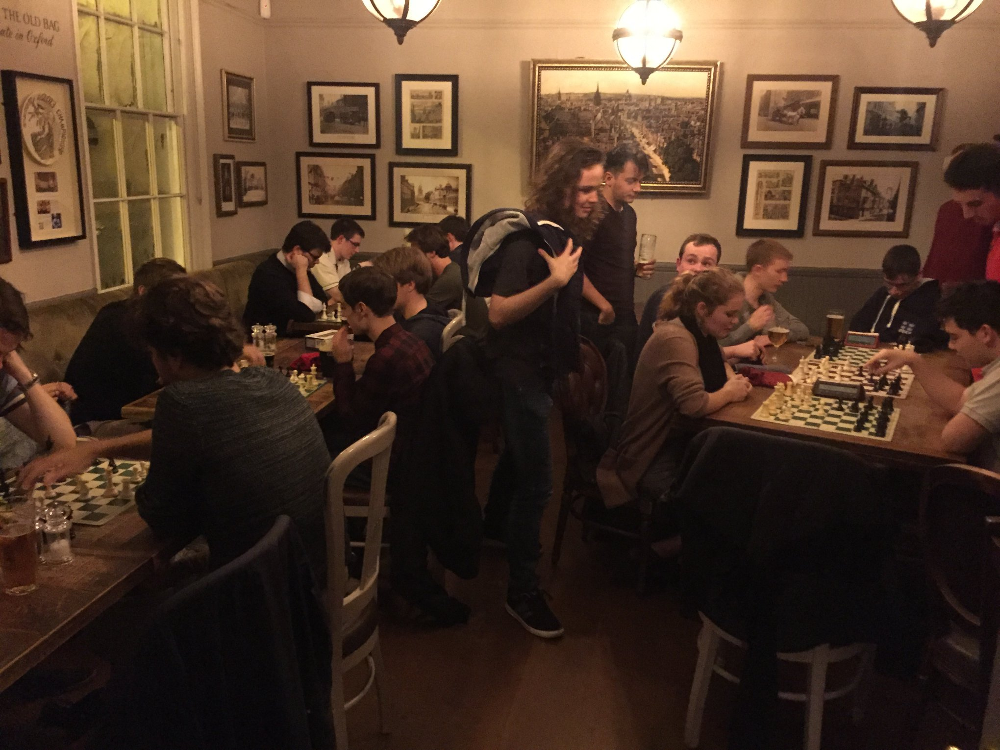

## Scouting talent for a new season!

### 9th October 2019 - by Aloysius Lip

We really enjoyed meeting you all at freshers' fair and welcome drinks!

There's a whole host of exciting chess on offer this term. We play at club nights every Wednesday at Christ Church at 7pm. Coming soon is the Freshers "Varsity" tournament, where we send down our best of our new intake to challenge their opposite numbers on the Cambridge side.

Make sure to bookmark our [termcard](https://users.ox.ac.uk/termcard) to keep up with everything going on.

Finally, like our [Facebook page](https://www.facebook.com/oxfordunichess/) and join our [Facebook group](https://www.facebook.com/groups/oxford.chess.club/) to stay updated on all the latest announcements as they're released.