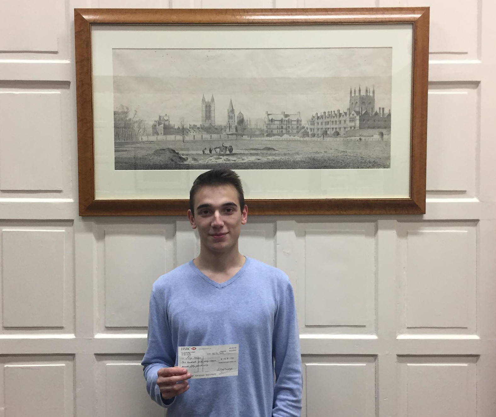

## Oxford's First Team Captain wins the Witney Congress

### Sunday 3rd November - by Aloysius Lip
### Filip Mihov, the OUCC's first team captain and runaway star of the university's high-level chess, scored another tournament win at the Witney Congress 

The tournament was played on 2nd - 3rd Novermber, it was a 5 round Swiss with 18 people participating. By ECF ratings, Filip would have been seeded joint 1st, but by FIDE ratings he was seeded 3rd, behind FMs David Zakarian and Andrew Bigg. It was played at Cokethorpe School, close to Witney. 

The first day went well, in the first round when paired black against a promising young talent Britnell Jonathan (169). Filip won a fine game in a Sicilian. But the most surprising result of the round was Otto Rasanen's win with black against the top seed FM David Zakarian (2372 fide).

The second round brought Filip's first serious challenge. He was white against the only person against whom he drew in the ODCL last year, Paul Girdlestone. A very complicated battle in a Nimzo-Indian ensued, where Filip emerged on top. Again, a surprise came from Otto, who only drew from a much better position against the other FM Andrew Bigg (2266).

Then in the third round Filip pliad black against the fourth seed Stephen Peters (196). He won a nice attacking game with black and was leading on 3/3. Otto also won and was on 2.5/3.

The two were paired against each other in the fourth round. There was a complicated middlegame where he was playing incredebly well, was practically winning, but failed to find a clear-cut path to victory, and although in time trouble, Filip somehow miraculously saved a draw, so was half a point ahead of the field going to the last round.

In the fifth round Filip was paired white against Richard McNally, played very safely with white and won, clinching the first place on 4.5/5.

This comes on the back of Filip's victory in the [Cowley Blitz tournament last term](#filip-wins-the-cowley-blitz-hashim-takes-best-unrated) and his award for the best player in the ODCL first division last season.

[Full results](https://chess-results.com/tnr485386.aspx?lan=1&art=1&rd=5)