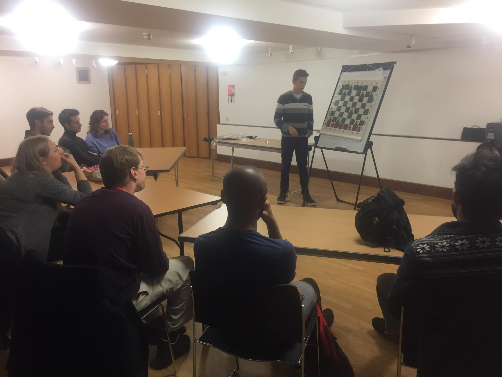

## OUCC relaunches teaching sessions

### 8th November 2019 - by Aloysius Lip

Pleased to see a relaunch of the weekly teaching sessions for our club members. Whilst we are somewhat hindered by a lack of local IMs who can drop in our teach, we have two excellent teachers from within our own club ranks to run these sessions - Victor Văsieșiu (FM, 1st Team Board 1) and Filip Mihov (1st Team Captain). They're to take place on Fridays at 5:30 at Christ Church for the rest of the term, open to all members.

