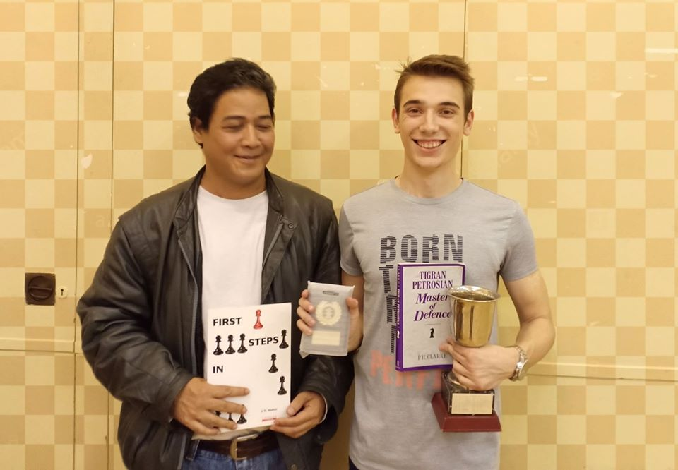

## Filip wins the Cowley Blitz, Hashim takes best unrated

### Saturday 24th June - by Aloysius Lip

Two of our members, Filip Mihov (1st Team Captain, Secretary) and Hashim Jusoh, went down to our neighbouring club Cowley Chess Club to play in their annual Summer Blitz Tournament. The tournament was 5 rounds of 3+2, with 2 games per round.

Filip won the tournament with a competition-sweeping 9.5/10; Hashim scored the prize for best unrated player with 6/10. Congratulations to them both!