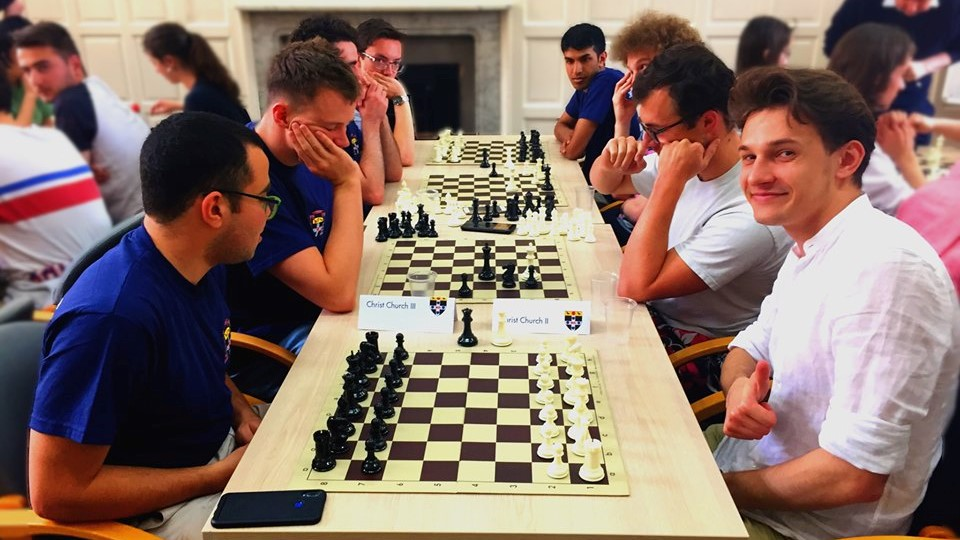

## Magdalen claim victory in Chess Cuppers tournament 2018

### 6th June 2019 - by Alex Hardwick
### Originally published in [Cherwell, 6th June 2019](https://cherwell.org/2019/06/06/magdalen-claim-victory-in-chess-cuppers-tournament)

Few crowds ever out-flock the bustling tourists of Christ Church’s Tom Quad, but on one sunny Saturday afternoon, the feat was achieved by a set of chess players, brought together by the Oxford University Chess Club (OUCC) for the annual Cuppers tournament. Seventeen teams, each of four players, entered from thirteen different colleges. The three-hour tournament resulted in a victory for Magdalen College’s first team.

Several teams threw down a serious challenge for the title. Magdalen I, looking to defend their title after last year’s victory, fielded former national English player Daniel Abbas and former national Singaporean player Ben Foo. Christ Church I proved stiff competition though with Isaac Sanders, a UK top-50 player, and Aloysius Lip, another England squad alumnus. Balliol and St Hilda’s were also threatening contenders, with highly rated captains Filip Mihov and Richard Zhu. The tournament featured five rounds of ‘blitz’ in which each player had only ten minutes to make all their moves, far faster than multi-hour ‘standard’ games. The result was many exciting and heated finishes.

Early round pairings were a slaughterhouse. Magdalen I took an emphatic 4-0 win against Lincoln; Balliol demolished Magdalen II; St Hilda’s showed no mercy against Christ Church III; and Christ Church I stole a confident 3-1 against Linacre. Magdalen I progressed with two more clean sweeps against St Hilda’s and Pembroke gaining an all-important lead. Christ Church I, Worcester, Lady Margaret Hall, and St Hilda’s chased narrowly behind, all drawing their Round Three matches.

The drama peaked in Round Four with the long-awaited clash between Christ Church I and Magdalen I. The Magdalen skipper on Board Three set the tone with a quick win, and it was followed soon by flawlessly commanding games by Magdalen Boards Two and Four to claim the match. Magdalen I were only denied a clean sweep in the face-off between the tournament’s two strongest players, Sanders and Abbas. Both clocks ticked down to two seconds apiece in a highly-tactical endgame, before Abbas snatched a last-gasp draw, sealing a 3.5-0.5 Magdalen win.

The final round cleared up the score table. LMH yearned for a last-minute steal for the title; Magdalen cruelly crushed their hopes in Round Five with a 3-1 putdown. They did, however, score a notable upset win of Luke Herlihy against Foo, and the team finished third, edging out St Peter’s I and Christ Church I on tiebreak. Pembroke took second place with an admirable four wins. The “best second team” title was awarded to St Peter’s II, slipping past a hard-battling Christ Church II. The overall champions were inevitably Magdalen I. The team’s performance was hugely impressive: they claimed a victory in all five rounds and conceded only a single loss and a draw on game points. Many congratulations to Daniel Abbas, Ben Foo, Alexander Hardwick, and Christopher Finn for an unassailable performance.

In the end, all agreed that the tournament was thrilling to play in for relative beginners and experienced competitors alike and ran seamlessly. The seamless organisation of the tournament by the Oxford University Chess Club night was certainly a credit to them, and if the hotly-contested competition this year has been anything to go by, who knows who will be fighting to take the title in Chess Cuppers 2020.