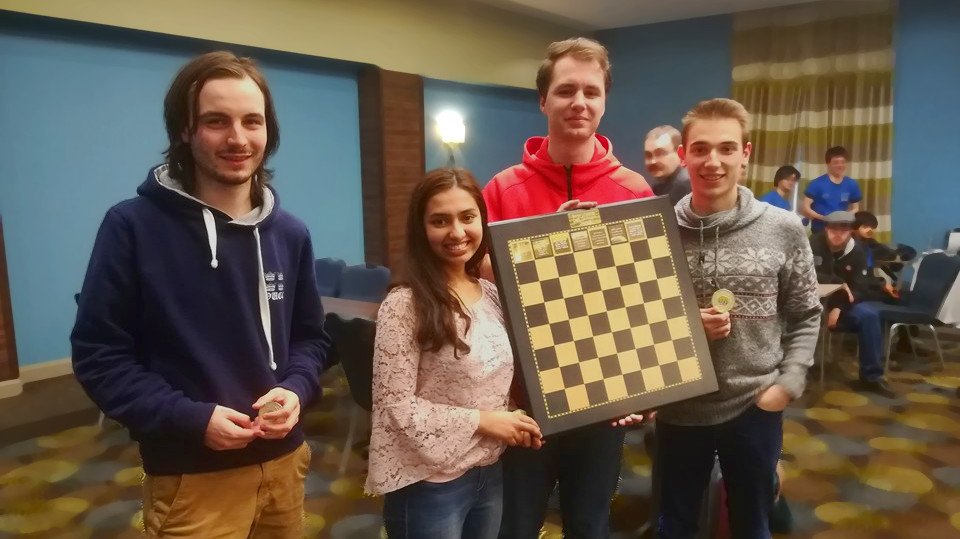

## Oxford wins BUCA

### Monday 24th February 2020 - by Joris Gerlagh
### Oxford dominated the British Universities Chess Association Championship, winning all of their matches.

The British Universities Chess Association (BUCA) Championship is the official annual tournament between universities in chess. It was played this year on 22nd - 23rd February in Birmingham as a 5-round Swiss tournament with the 10 strongest British universities. Oxford sent 4 of their strongest players: Joris Gerlagh, a 4th-year chemistry student at Univ; Filip Mihov, a 2nd-year computer scientist at Balliol, and freshers FM Victor Vasiesiu, and FM Akshaya Kalaiyalahan, at Hertford and Regent's Park College respectively. The goal: to win glory for a title not seen by Oxford since 2011 and qualify for a place at the subsequent European championship. Though seeded second and facing strong challengers, Oxford triumped throughout the weekend, winning the tournament with a perfect score of 10 out of 10 match points and an unbeaten record for every team member.

The first round was played against Imperial proved a close matchup. A strong university club featuring the national champion of Malaysia among their members, Imperial had achieved a 1-1 record over the course of two friendly matches with Oxford organised in Michaelmas and Hilary. Here they lay down an impressive challenge, with each game  spanning nearly three hours. Finally, Oxford took home an overall victory with hard-fought draws on boards 1, 2 and 4 and Victor winning on board 3 for a game score of 2.5-1.5.

In the second round, Oxford were paired against first seed Cambridge, in a match that held significance both for the tournament tournament and symbolically, in lieu of the upcoming Varsity match. After a quick draw on board 3, an opposite colour bishop's endgame led to a draw on board 1. This left the fate in the hands of board 2, where Filip had just made an impressive exchange sacrifice, and board 4, where Akshaya had been winning from early on in the opening, but lacked time to rest easy. Both games were soon converted into wins, bringing the team to a celebratory mood as the competition's strongest team with a better record than Oxford on paper had just been conquered. From hereon, it seemed victory was inevitable.

The following rounds served as an exercise for Oxford's well-trained players to execute their victories. The third round against Warwick, the only other team still with a perfect score, was won with wins on boards 2 and 3 and draws on 1 and 4, cementing our position on top. The 4th round against LSE, played the next day, began with a quick draw on board 1, followed some time later by draws on board 2 and 4. Unease arose - all players felt that more could have been achieved from their games and the fate of the match was still in balance. Victor quickly decided the match with a win on board 3. That placed a humble demand on the fifth and final round against Bristol; a mere 2-2 draw would suffice to win the Championship. Yet Oxford's players were not content without a perfect score. After a quick draw on board 1, punishing wins on boards 2 and 3 and draw on board 4 sealed the victory. Oxford had achieved total domination of the championship, with wins in all their matches and an unbeaten record for every player.

Thus, Oxford managed to win BUCA for the first time in 9 years and now march on towards the European Championship as national champions.

The tournament also featured a Blitz tournament on the Saturday night, in which Filip was the only Oxford player to participate, finishing joint 6th on 6.5/9. The team's score in the Championship was 8 individual wins and 12 draws. Particular accolades go to Victor, who won a gold medal for his unrivalled performance of 4.5/5.

[Full results](http://www.4nclresults.co.uk/2019-20/media/buca/prog-div1.html)
