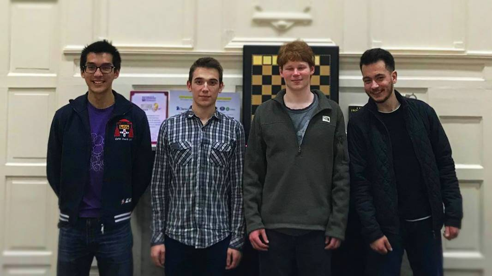

# Committee 2020-21

Thanks to everyone who attended our AGM last night. It was full of bughouse and pizza, plus a certain Vice President-elect losing many many games. Shout out to Andrew Rogozinski for beating a random guy at the KA blindfold 4 pints in. We're also pleased to announce we have elected a new committee for 2020-21! It is as follows:  

President: Aloysius Lip
Vice President: Ben Greenbury
Treasurer: Callum Evans
Secretary: Akshaya Kalaiyalahan
Varsity Captain: Victor Văsieșiu
First Team Captain: Dan Sutton
Second Team Captain: Jack Virgin
Third Team Captain: George Dumitrescu
Outreach Officer: Dan Sutton
Cuppers League Officer: Kevin Henbest
Teaching Officer: Victor Văsieșiu
Women's Officer: Akshaya Kalaiyalahan
Graduates' Officer: Süleyman Selim
Social Officer: Rachel Wong
Digital Officer: Andrew Rogozinski  
  
Many thanks to our last year's committee, for what has been one of the most successful years in the history of Oxford University Chess Club ever. It's quite unnecessary to show it in terms of mere appreciation, the record itself demonstrates it. This year we became British Universities' Chess Association champions (for the first time in 9 years) with a perfect score, qualified to represent #TeamGB at EUSA Chess, won the ODCL's first division, finished first in a 2020 Chess Qualifiers round, restarted and won the historic Valentines Cup match with Imperial College London, launched a successful new University of Oxford Cuppers League with 11 teams taking part, reached out to 3 of our nearby friendly universities and organised matches against them, invited GM WGM Yifan Hou and GM Keith Arkell for simultaneous exhibition events, and have secured funding ensuring the club's continued welfare with our new partners Jane Street Recruiting and Chess and Bridge Shop. We also donated over £150 to Oxfam, through our collaboration with 2020 chess, including donating our £100 prize money from its regional qualifiers. It's only gonna get better from here folks.
The outgoing committee for 2019-20:  
  
President: Andrew Rogozinski
Treasurer: Aloysius Lip
Vice President: George Dumitrescu
Secretary: Filip Mihov
Varsity Captain: Daniel Abbas
First Team Captain: Filip Mihov
Second Team Captain: Kevin Henbest
Third Team Captain: Boris Gusev
Outreach Officer: Dan Sutton
Cuppers League Officer: Ben Greenbury
Teaching Officer: Victor Văsieșiu
Digital Officer: Aloysius Lip

